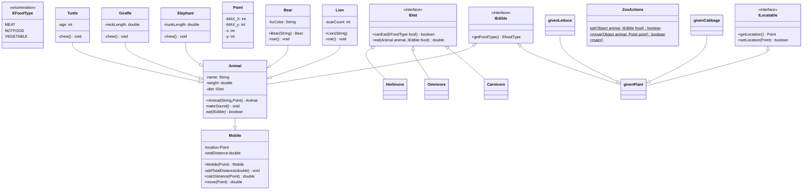

# Mermaid something

Let's go!

<<>> indicator to interface/enumeration and not a class. 
 '+' is public. 
 '-' is private. 
 '#' is protected.  
inheritance is indicated by Class A <|-- Class B
aggregation is indicated by Class A o-- Class B
composition is indicated by Class A *-- Class B
